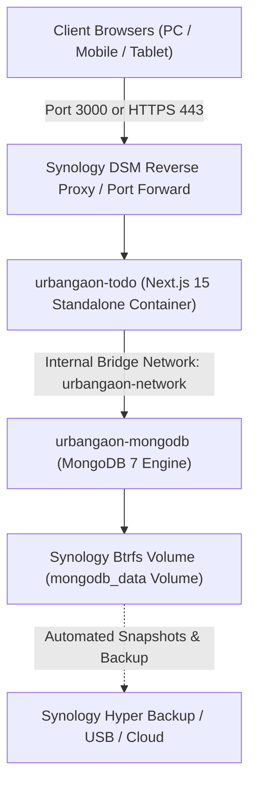

# 🚀 Synology DS925+ NAS Deployment Guide (UrbanGaon AI Todo Platform)
> **Target Hardware:** Synology DS925+ / DS923+ (AMD Ryzen R1600 x86_64, DSM 7.2+)  
> **Architecture:** 100% Private, On-Premise Self-Hosted (Next.js 15 Standalone + Local MongoDB 7)  
> **Prepared by:** SDE-3 & Executive Infrastructure Lead

---

## 📌 Architecture Overview



- **Zero Cloud Leakage**: All tasks, users, subtasks, and audit logs stay entirely inside your Synology DS925+ NAS.
- **Data Persistence**: MongoDB stores data in a dedicated Docker volume that survives NAS restarts and DSM updates.
- **Instant Restart**: Auto-restart policy `unless-stopped` keeps the dashboard running 24/7.

---

## 🛠️ Prerequisites on Synology DSM

1. Open your Synology DSM web portal (`http://<NAS_IP>:5000` or `https://<NAS_IP>:5001`).
2. Open **Package Center**.
3. Search for **Container Manager** (formerly Docker) and install it.
4. Ensure the shared folder `/docker` exists in **File Station** (it is created automatically when Container Manager is installed).

---

## 📁 Method 1: GUI-Based Deployment via DSM Container Manager (Recommended)

### Step 1: Copy Project Files to Synology NAS
1. Open **File Station** on DSM.
2. Inside `/docker/`, create a new folder named `urbangaon-todo`:
   ```
   /docker/urbangaon-todo/
   ```
3. Upload all project files into this folder:
   - `src/`
   - `public/`
   - `package.json`
   - `package-lock.json`
   - `next.config.ts`
   - `tsconfig.json`
   - `Dockerfile`
   - `docker-compose.yml`
   - `.dockerignore`
   - `.env.nas.example` *(rename to `.env` after uploading)*

> 💡 **Quick Tip:** You can zip the project folder on your PC, upload `urbangaon-todo.zip` via File Station, right-click, and select **Extract Here**.

### Step 2: Configure Environment (`.env`)
1. In File Station, find `.env.nas.example` inside `/docker/urbangaon-todo/`.
2. Rename it to `.env` (or create a `.env` file).
3. Right-click `.env` and select **View/Edit** (Text Editor):
   - Set `MONGO_PASSWORD`: Choose a strong password.
   - Set `JWT_SECRET`: Random 32+ character string.
   - Set `GEMINI_API_KEY`: *(Optional)* Your Google Gemini key for AI task creation.
   - Set `NEXT_PUBLIC_APP_URL`: `http://<YOUR_NAS_IP>:3000` (e.g. `http://192.168.1.100:3000`).
4. Save the file.

### Step 3: Launch in Container Manager
1. Open the **Container Manager** app from the DSM Main Menu.
2. Click on the **Project** tab on the left sidebar.
3. Click **Create** (Create Project):
   - **Project Name:** `urbangaon-todo`
   - **Path:** Browse and select `/docker/urbangaon-todo`
   - **Source:** Select **"Use existing docker-compose.yml"**
4. Click **Next**.
5. *(Web portal settings can be skipped or left as default)*.
6. Click **Done** (Check the box *"Start the project after it is created"*).
7. Container Manager will download `mongo:7`, build the Next.js standalone container, and start both containers.

Once both icons turn **Green (Running)**, open your browser:
👉 **`http://<YOUR_NAS_IP>:3000`**

---

## ⚡ Method 2: CLI Deployment via SSH (Fastest for Power Users)

If you have SSH enabled on your Synology NAS:

1. **Enable SSH** (if not already enabled):  
   DSM -> *Control Panel* -> *Terminal & SNMP* -> Check *Enable SSH service* (Port 22).

2. **Connect via Terminal / PowerShell**:
   ```bash
   ssh admin@<YOUR_NAS_IP>
   ```

3. **Navigate to the Docker Directory & Create Folder**:
   ```bash
   cd /volume1/docker
   mkdir -p urbangaon-todo
   cd urbangaon-todo
   ```

4. **Copy Code & Setup `.env`**:
   Upload files or clone via git, then:
   ```bash
   cp .env.nas.example .env
   # Edit variables using nano or vi
   vi .env
   ```

5. **Build and Start in Background**:
   ```bash
   sudo docker compose up -d --build
   ```

6. **Check Container Status**:
   ```bash
   sudo docker compose ps
   sudo docker compose logs -f
   ```

---

## 🔒 Production Security: HTTPS & Custom Domain (DSM Reverse Proxy)

To access your dashboard securely with HTTPS (e.g. `https://todo.yourcompany.com` or `https://nas.local:8443`) with free Let's Encrypt SSL:

1. In DSM, go to **Control Panel** ➔ **Login Portal** ➔ **Advanced** ➔ **Reverse Proxy**.
2. Click **Create**:
   - **General:**
     - Reverse Proxy Name: `UrbanGaon Todo`
   - **Source:**
     - Protocol: `HTTPS`
     - Hostname: `todo.yourcompany.com` (or your Synology DDNS: `yourname.synology.me`)
     - Port: `443`
     - Enable HSTS: Checked
   - **Destination:**
     - Protocol: `HTTP`
     - Hostname: `localhost`
     - Port: `3000`
   - **Custom Header** (Crucial for Real-Time SSE Sync & WebSockets):
     - Click **Create** ➔ **WebSocket**.
     - It will automatically add `Upgrade` and `Connection` headers.
3. Click **Save**.
4. Go to **Control Panel** ➔ **Security** ➔ **Certificate** ➔ Assign your Let's Encrypt SSL certificate to the `UrbanGaon Todo` reverse proxy.

---

## 💾 Zero-Downtime Backup & Disaster Recovery

Your database is stored in the Docker volume `mongodb_data`.

### 1-Click Automated Backup via Synology Hyper Backup:
1. Open **Hyper Backup** in DSM.
2. Select target (External USB Drive, Synology C2, or another NAS/S3).
3. Under **Folders**, select the `/docker/urbangaon-todo` shared folder.
4. Set daily schedule (e.g., 03:00 AM).

### Manual One-Liner DB Dump:
To make an instant snapshot of your entire database directly to an archive file:
```bash
sudo docker exec urbangaon-mongodb mongodump --username urbangaon_admin --password urbangaon_secure_2026 --authenticationDatabase admin --db urbangaon_todo --archive=/data/db/backup_$(date +%Y%m%d).archive
```

---

## 🔄 How to Update When You Make Code Changes

### Option A: Fully Automated via Synology Task Scheduler (Easiest & Most Popular)
You don't need any third-party tools or port forwarding! Synology has a built-in **Task Scheduler** that can check Git and auto-deploy whenever you push code.

1. Upload [`scripts/nas-auto-update.sh`](file:///d:/TODO%20Dashboard%20%20New%20updated%20Version/scripts/nas-auto-update.sh) to `/volume1/docker/urbangaon-todo/scripts/nas-auto-update.sh`.
2. In Synology DSM, go to **Control Panel** ➔ **Task Scheduler**.
3. Click **Create** ➔ **Scheduled Task** ➔ **User-defined script**:
   - **General:**
     - Task: `Auto-Update UrbanGaon Todo`
     - User: `root` (Important: must be root to execute Docker commands)
     - Enabled: Checked
   - **Schedule:**
     - Run every: **5 minutes** (or 2 minutes)
   - **Task Settings:**
     - User-defined script:
       ```bash
       bash /volume1/docker/urbangaon-todo/scripts/nas-auto-update.sh
       ```
4. Click **OK**.

**How it works:**
Whenever you run `git push origin main` from your PC:
- The script detects new commits automatically.
- Pulls the changes and rebuilds only the `urbangaon-todo` container.
- MongoDB stays 100% online with zero data loss.
- Logs are saved cleanly in `/volume1/docker/urbangaon-todo/deploy.log`.

---

### Option B: Enterprise CI/CD Pipeline (GitHub Actions + Watchtower)
If you prefer building Docker images on GitHub's powerful servers (saving NAS CPU):

1. Commit and push [`.github/workflows/docker-build-push.yml`](file:///d:/TODO%20Dashboard%20%20New%20updated%20Version/.github/workflows/docker-build-push.yml) to GitHub.
2. In `docker-compose.yml`, uncomment the `watchtower` service.
3. Replace the `build: .` line in `urbangaon-todo` with `image: ghcr.io/<your-github-username>/todo-dashboard:latest`.
4. Whenever you `git push`, GitHub Actions builds the image, and Watchtower automatically pulls and restarts the container on your NAS within 2-5 minutes!

---

### Option C: Manual 10-Second Command (SSH)
```bash
cd /volume1/docker/urbangaon-todo
git pull origin main
sudo docker compose up -d --build urbangaon-todo
```
